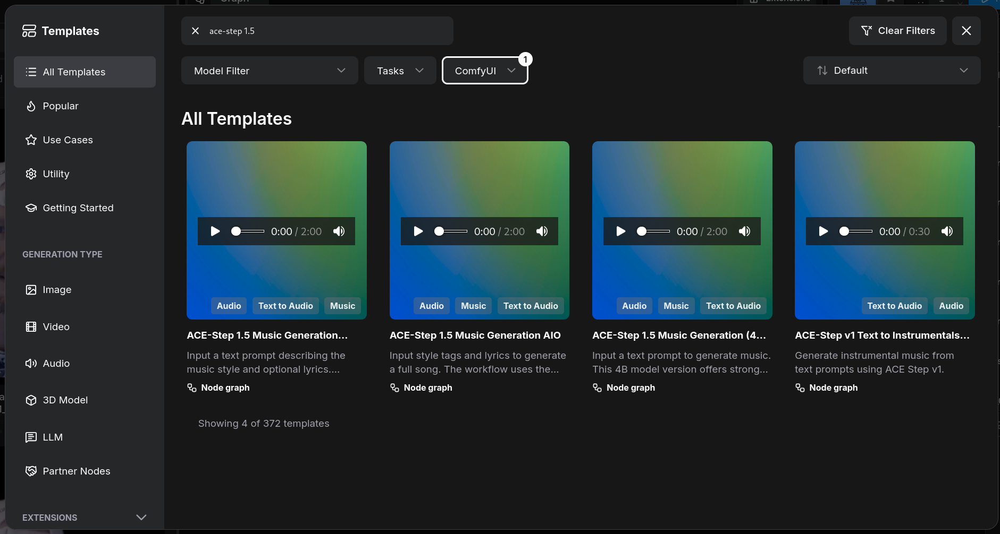
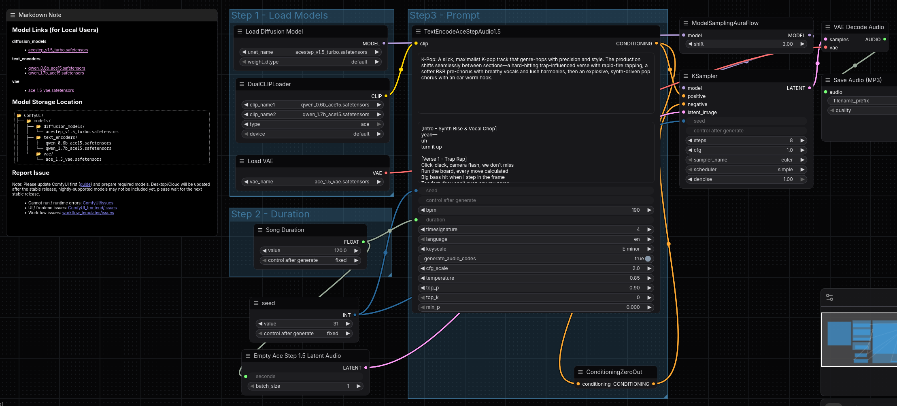

# Music Generation + Video Sync

## ComfyUI + ACE-Step 1.5 + LTX2.3

### ACE-Step 1.5 Music Generation

ACE-Step-1.5 is a highly efficient, open-source music foundation model designed to generate commercial-grade music on consumer-level hardware. It is often described as the "Stable Diffusion of music" because it can be run locally and supports extensive personalization.

Hugging Face: [https://huggingface.co/ACE-Step/acestep-v15-xl-turbo](https://huggingface.co/ACE-Step/acestep-v15-xl-turbo)

Github: [https://github.com/ace-step/ACE-Step-1.5.git](https://github.com/ace-step/ACE-Step-1.5.git)

ACE-Step Template:

ACE-Step Workflow:

ACE-Step Prompt Guidlines:

Style Tags:

Lyrics:

[Verse]

[Chorus]

[Bridge]

### 
