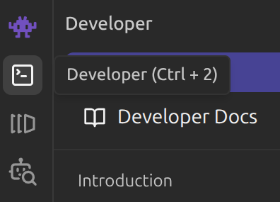
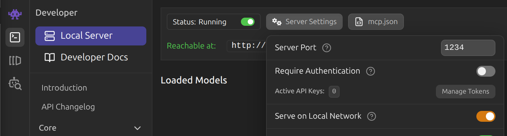

# Claude Code with custom Model on LM Studio

## LM Studio Config:

1. Download app image from https://lmstudio.ai/download
2. Set executable bit `chmod +x ~/Downloads/LM-Studio*`
3. Run LM Studio `~/Downloads/LM-Studio-0.4.6-1-arm64.AppImage --no-sandbox >/dev/null 2>&1 &`
5. Go to Developer Mode `Ctrl + 2` 
6. Select Local Server > Server Settings > Serve on Local Network 
7. Make Sure Status = Running (should say Reachable at: http://LOCAL_IP:PORT)
8. Load Model (assuming you already downloaded a model)
9. Set Context Length + any other settings (tempature, speculative decoding, thinking mode, system prompt, etc)

***Suggested Context Length of at least 65536 tokens***


## Claude Config:

`~/.claude/lmstudio.settings.json`

***Replace ANTHROPIC_BASE_URL with the IP and PORT of your LM studio server***

```bash
{
  "env": {
    "ANTHROPIC_BASE_URL": "http://192.168.6.181:1234/",
    "ANTHROPIC_AUTH_TOKEN": "dummy",
    "API_TIMEOUT_MS": "3000000",
    "CLAUDE_CODE_DISABLE_NONESSENTIAL_TRAFFIC": 1,
    "CLAUDE_CODE_ATTRIBUTION_HEADER": 0,
    "ANTHROPIC_MODEL": "default_model",
    "ANTHROPIC_SMALL_FAST_MODEL": "default_model",
    "ANTHROPIC_DEFAULT_SONNET_MODEL": "default_model",
    "ANTHROPIC_DEFAULT_OPUS_MODEL": "default_model",
    "ANTHROPIC_DEFAULT_HAIKU_MODEL": "default_model"
  }
}
```

## Launch Paramaters 

`claude --settings ~/.claude/lmstudio.settings.json`

