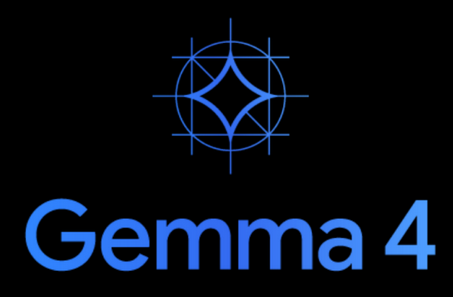

# Claude Code with custom Model on llama.cpp (Gemma 4)

## llama.cpp Setup:

### 1. Build llama.cpp from source (CUDA)

[https://github.com/ggml-org/llama.cpp](https://github.com/ggml-org/llama.cpp)

```bash
git clone https://github.com/ggml-org/llama.cpp
cd llama.cpp
cmake -B build -DGGML_CUDA=ON
cmake --build build --config Release --target llama-server -j$(nproc)
```

Binary will be at `./build/bin/llama-server`

> Recomend exporting this to PATH

```bash
echo 'export PATH="$PATH:$HOME/llama.cpp/build/bin"' >> ~/.bashrc && source ~/.bashrc
```

### 2. Download Gemma 4 GGUF Model



> Gemma-4-26B-A4B runs on 18GB (4-bit) or 28GB (8-bit). 

[https://huggingface.co/unsloth/gemma-4-26B-A4B-it-GGUF](https://huggingface.co/unsloth/gemma-4-26B-A4B-it-GGUF)

```bash
pip install huggingface_hub
```

```bash
mkdir -p ~/models
```

```bash
hf download unsloth/gemma-4-26B-A4B-it-GGUF --include "gemma-4-26B-A4B-it-MXFP4_MOE.gguf" --local-dir ~/models/gemma-4-26b-it-GGUF
```

### 3. Launch llama-server

```bash
~/llama.cpp/build/bin/llama-server \
  --model ~/models/gemma-4-26b-it-GGUF/gemma-4-26B-A4B-it-MXFP4_MOE.gguf \
  --alias default_model \
  --host 0.0.0.0 \
  --port 9090 \
  --n-gpu-layers 99 \
  --ctx-size 12581472 \
  --threads 8 \
  --reasoning off \
  --parallel 8 \
  --cache-type-k q4_0 \
  --cache-type-v q4_0 \
  --flash-attn on
```

Key flags:
- `--n-gpu-layers 99` — offload all layers to GPU (reduce if you hit VRAM limits)
- `--ctx-size` — Total context size (gets divided by parallel)
- `--alias` — sets the model name exposed on the API
- `--host 0.0.0.0` - Listen on all interfaces
- `--port 9090` - 8080 by defualt
- `--reasoning off` - easy toggle for thinking mode (slows down agentic coding)
- `--parallel 64` - concurency for agents and sub-agents
- `--cache-type-k/v` - Key/Value quantization (save vram)
- `--flash-attn on` - Speed up inference 

Verify it's running: `curl http://localhost:8080/v1/models`

***Claude code assumes a context of 200k***


## Claude Config:


`~/.claude/llamacpp.settings.json`

***Replace ANTHROPIC_BASE_URL with the IP and PORT of your llama-server***

```bash
{
  "env": {
    "ANTHROPIC_BASE_URL": "http://192.168.6.181:9090/",
    "ANTHROPIC_AUTH_TOKEN": "dummy",
    "API_TIMEOUT_MS": "3000000",
    "CLAUDE_CODE_DISABLE_NONESSENTIAL_TRAFFIC": 1,
    "CLAUDE_CODE_ATTRIBUTION_HEADER": 0,
    "ANTHROPIC_MODEL": "default_model",
    "ANTHROPIC_SMALL_FAST_MODEL": "default_model",
    "ANTHROPIC_DEFAULT_SONNET_MODEL": "default_model",
    "ANTHROPIC_DEFAULT_OPUS_MODEL": "default_model",
    "ANTHROPIC_DEFAULT_HAIKU_MODEL": "default_model"
  }
}
```

## Launch Parameters

`claude --settings ~/.claude/llamacpp.settings.json`


# Observations:

- llama.cpp natively exposes the Anthropic `/v1/messages` endpoint — no proxy required
- `--alias default_model` must match the `ANTHROPIC_MODEL` value in the settings JSON
- Monitor token generation rate and prompt eval rate via llama-server logs in stdout

# Issues:

## Tool Call Parsing

Gemma 4 may occasionally fail to produce well-formed JSON for tool calls, causing Claude Code to retry or error out. Increasing context size and using Q8 quantization can improve reliability.

## VRAM Limits

Reduce `--n-gpu-layers` to partially offload to CPU if you run out of VRAM. Performance will degrade significantly for CPU-offloaded layers.

```bash
# Check how many layers are loaded to GPU
curl http://localhost:8080/v1/models | python3 -m json.tool
```
