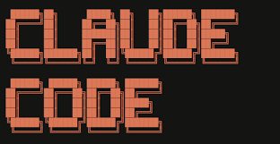

# Claude Code + LLaMA.cpp + Qwen3.6


## Step 1: Download Qwen 3.6 Model

<!--  -->


#### Hugging Face Model Card:

[https://huggingface.co/unsloth/Qwen3.6-35B-A3B-GGUF](https://huggingface.co/unsloth/Qwen3.6-35B-A3B-GGUF)

```bash
pip install huggingface_hub
```

```bash
mkdir -p ~/models
```

```bash
hf download unsloth/Qwen3.6-35B-A3B-GGUF \
    --include "Qwen3.6-35B-A3B-UD-Q4_K_M.gguf" \
    --local-dir ~/models/
```

## Step 2: Setup LLaMA.cpp:

### 2-A: Build llama.cpp from source (CUDA)

[https://github.com/ggml-org/llama.cpp](https://github.com/ggml-org/llama.cpp)

```bash
git clone https://github.com/ggml-org/llama.cpp
cd llama.cpp
cmake -B build -DGGML_CUDA=ON
cmake --build build --config Release --target llama-server -j$(nproc)
```

Binary will be at `./build/bin/llama-server`

> Recomend exporting this to PATH

```bash
echo 'export PATH="$PATH:$HOME/llama.cpp/build/bin"' >> ~/.bashrc && source ~/.bashrc
```


### 2-B: Launch llama-server

```bash
~/llama.cpp/build/bin/llama-server \
  --model ~/models/Qwen3.6-35B-A3B-UD-Q4_K_M.gguf \
  --host 0.0.0.0 \
  --port 9090 \
  --gpu-layers 99 \
  --ctx-size $((262144*4)) \
  --parallel 4 \
  --cache-type-k q8_0 \
  --cache-type-v q8_0 \
  --flash-attn on \
  --reasoning off \
  --jinja \
  --batch-size 32768 \
  --ubatch-size 2048 \
  --cont-batching \
  --no-context-shift \
  --defrag-thold 0.1 \
  2>&1 | tee ~/llama-server.log
```

Useful Flags:
- `--n-gpu-layers 99` — offload all layers to GPU (reduce if you hit VRAM limits)
- `--ctx-size` — Total context size (gets divided by parallel)
- `--alias` — sets the model name exposed on the API
- `--host 0.0.0.0` - Listen on all interfaces
- `--port 9090` - 8080 by default
- `--reasoning off` - easy toggle for thinking mode (CoT typically slows down agentic coding)
- `--parallel` - concurency for agents and sub-agents
- `--cache-type-k/v` - Key/Value quantization (save vram)
- `--flash-attn on` - Speed up inference and reduces memory [***warning: can reduce quality***]
- `--batch-size` - Tokes processed per forward pass (scheduling)
- `--ubatch-size` - Physical maximum batch size (execution)
- `--cont-batching` - Continuous batching (processing multiple requests simultaneously)
- `--metrics` - enables endpoint that exposes real-time performance and usage data

Verify it's running: `curl http://192.168.6.181:9090/v1/models`

***Claude code assumes a context of 200k***

> if you want to run **more than one model on llama.cpp** you need sperate instances of `llama-server` on a different ports `--port`

> llama.cpp also has a web interface `http://192.168.6.181:9090` that is useful for Chat GPT style Q&A and to see things like Prompt Processing t/s and Generation t/s
>
> key and valude quantization can be set asyncronusly which will probably be a go to best practice for near future tech like turboquant

#### Reference table for setting total context

| Context| bits (n) | value (2^n) | --parallel 4 | --parallel 8 |
|:---:|:---:|:---:|:---:|:---:|
| ~1k | 10 | 1024 | 256 | 128 |
| ~2k | 11 | 2048 | 512 | 256 |
| ~4k | 12 | 4096 | 1024 | 512 |
| ~8k | 13 | 8192 | 2048 | 1024 |
| ~16k | 14 | 16384 | 4096 | 2048 |
| ~32k | 15 | 32768 | 8192 | 4096 |
| ~64k | 16 | 65536 | 16384 | 8192 |
| ~128k | 17 | 131072 | 32768 | 16384 |
| ~256k | 18 | 262144 | 65536 | 32768 |
| ~512k | 19 | 524288 | 131072 | 65536 |
| 1M | 20 | 1048576 | 262144 | 131072 |
| 2M | 21 | 2097152 | 524288 | 262144 |




## Step 3: Claude Config

Create file: `~/.claude/llamacpp.settings.json`

**Replace `ANTHROPIC_BASE_URL` with the `IP` and `PORT` of your llama-server**

```bash
{
  "env": {
    "ANTHROPIC_BASE_URL": "http://192.168.6.181:9090/",
    "ANTHROPIC_AUTH_TOKEN": "dummy",
    "API_TIMEOUT_MS": "3000000",
    "CLAUDE_CODE_DISABLE_NONESSENTIAL_TRAFFIC": 1,
    "CLAUDE_CODE_ATTRIBUTION_HEADER": 0,
    "ANTHROPIC_MODEL": "llama.cpp_model"
  }
}
```

## Step 4: Launch 🚀

`claude --settings ~/.claude/llamacpp.settings.json`


### Observations:

- llama.cpp natively exposes the Anthropic `/v1/messages` endpoint — no proxy required
- `--alias llama.cpp_model` **DOES NOT** need to match the `ANTHROPIC_MODEL` value in the settings JSON, which is different from connecting claude code to LM Studio
- Monitor token generation rate and prompt eval rate via llama-server logs in stdout

### Issues:

#### **Plan Mode YOLO**

Sometimes the plan never says "Approve and Bypass Permissions"... it Just go's ***hard***


