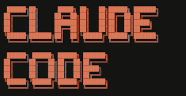

# Claude Code + vLLM + DiffusionGemma




This guide shows how to run **DiffusionGemma 26B-A4B NVFP4** locally with **vLLM** and point **Claude Code** at it through the Anthropic-compatible `/v1/messages` endpoint.

The setup below was tested on an **NVIDIA DGX Spark / GB10** workstation with unified memory.

Model used:

[https://huggingface.co/nvidia/diffusiongemma-26B-A4B-it-NVFP4](https://huggingface.co/nvidia/diffusiongemma-26B-A4B-it-NVFP4)

---

## What is DiffusionGemma?

DiffusionGemma is a diffusion language model. Instead of generating text strictly one token at a time like a normal autoregressive model, it fills and refines a text canvas over denoising steps.

In practice, this means:

- It can commit tokens in chunks.
- Throughput numbers can look different from standard autoregressive models.
- `max_tokens` is a limit, not a guarantee. The model may stop naturally before using the whole budget.
- The vLLM launch flags matter a lot. Missing the diffusion-specific flags can cause empty or poor completions.

---

## Step 1: Requirements

This guide assumes:

- Docker is installed
- NVIDIA container runtime is working
- Hugging Face access is configured
- Port `8000` is available
- Claude Code is installed

Check Docker:

```bash
docker -v
```

Check GPU visibility from Docker:

```bash
docker run --rm --gpus all nvidia/cuda:13.0.0-base-ubuntu24.04 nvidia-smi
```

> On DGX Spark / GB10, `nvidia-smi` may show GPU memory as `Not Supported` because the system uses unified memory. Process-level GPU memory is still useful.

---

## Step 2: Hugging Face login / model cache

If needed, log in to Hugging Face:

```bash
hf auth login
```

Optional: pre-download the model:

```bash
hf download nvidia/diffusiongemma-26B-A4B-it-NVFP4
```

The Docker command below mounts your local Hugging Face cache into the container:

```bash
-v ~/.cache/huggingface:/root/.cache/huggingface
```

---

## Step 3: Start vLLM with DiffusionGemma

Create a shell function or run this directly.

```bash
start-diffusiongemma-vllm () {
  docker rm -f diffusiongemma >/dev/null 2>&1 || true

  docker run -itd --name diffusiongemma \
    --ipc=host \
    --network host \
    --gpus all \
    -v ~/.cache/huggingface:/root/.cache/huggingface \
    vllm/vllm-openai:gemma \
      nvidia/diffusiongemma-26B-A4B-it-NVFP4 \
      --max-model-len 131072 \
      --max-num-seqs 4 \
      --gpu-memory-utilization 0.75 \
      --generation-config vllm \
      --hf-overrides '{"diffusion_sampler":"entropy_bound","diffusion_entropy_bound":0.1}' \
      --diffusion-config '{"canvas_length":256}' \
      --enable-chunked-prefill \
      --enable-auto-tool-choice \
      --tool-call-parser gemma4 \
      --host 0.0.0.0 \
      --port 8000
}
```

Run it:

```bash
start-diffusiongemma-vllm
```

### Why these flags matter

Useful flags:

- `--max-model-len 131072` — enables 128k context.
- `--max-num-seqs 4` — allows four active requests at once. More client requests will queue.
- `--gpu-memory-utilization 0.75` — conservative setting for an active workstation.
- `--hf-overrides '{"diffusion_sampler":"entropy_bound","diffusion_entropy_bound":0.1}'` — known-good DiffusionGemma sampler settings.
- `--diffusion-config '{"canvas_length":256}'` — known-good canvas size.
- `--enable-auto-tool-choice` — required if Claude Code sends `tool_choice: auto`.
- `--tool-call-parser gemma4` — required with `--enable-auto-tool-choice` for Gemma-style tool calls.
- `--enable-chunked-prefill` — helps with long context.

Without the tool-choice flags, Claude Code can fail with:

```text
API Error: 400 "auto" tool choice requires --enable-auto-tool-choice and --tool-call-parser to be set
```

---

## Step 4: Watch startup

Show logs:

```bash
docker logs -f diffusiongemma
```

Expected route list includes:

```text
/v1/models
/v1/chat/completions
/v1/messages
```

Verify the model is registered:

```bash
curl http://127.0.0.1:8000/v1/models
```

Expected model id:

```text
nvidia/diffusiongemma-26B-A4B-it-NVFP4
```

Expected context length:

```text
max_model_len: 131072
```

---

## Step 5: Smoke test vLLM

Test OpenAI chat completions:

```bash
curl -sS --max-time 180 http://127.0.0.1:8000/v1/chat/completions \
  -H 'Content-Type: application/json' \
  -d '{
    "model":"nvidia/diffusiongemma-26B-A4B-it-NVFP4",
    "messages":[{"role":"user","content":"In one sentence, say that DiffusionGemma is ready."}],
    "max_tokens":128,
    "temperature":0.7
  }'
```

Test Anthropic messages:

```bash
curl -sS --max-time 180 http://127.0.0.1:8000/v1/messages \
  -H 'Content-Type: application/json' \
  -H 'x-api-key: dummy' \
  -H 'anthropic-version: 2023-06-01' \
  -d '{
    "model":"nvidia/diffusiongemma-26B-A4B-it-NVFP4",
    "max_tokens":256,
    "messages":[{"role":"user","content":"Write one paragraph explaining what a diffusion language model is."}]
  }'
```

Test Anthropic tool use:

```bash
curl -sS --max-time 180 http://127.0.0.1:8000/v1/messages \
  -H 'Content-Type: application/json' \
  -H 'x-api-key: dummy' \
  -H 'anthropic-version: 2023-06-01' \
  -d '{
    "model":"nvidia/diffusiongemma-26B-A4B-it-NVFP4",
    "max_tokens":256,
    "tool_choice":{"type":"auto"},
    "tools":[{
      "name":"get_time",
      "description":"Get the current time for a city.",
      "input_schema":{"type":"object","properties":{"city":{"type":"string"}},"required":["city"]}
    }],
    "messages":[{"role":"user","content":"What time is it in Denver? Use a tool if needed."}]
  }'
```

Expected result is a `tool_use` block, not a 400 error.

---

## Step 6: Claude Code config

Create file:

```text
~/.claude/vllm.settings.json
```

Use this config:

```json
{
  "env": {
    "ANTHROPIC_BASE_URL": "http://127.0.0.1:8000",
    "ANTHROPIC_AUTH_TOKEN": "dummy",
    "API_TIMEOUT_MS": "3000000",
    "CLAUDE_CODE_DISABLE_NONESSENTIAL_TRAFFIC": "1",
    "CLAUDE_CODE_ATTRIBUTION_HEADER": "0",
    "ANTHROPIC_MODEL": "nvidia/diffusiongemma-26B-A4B-it-NVFP4",
    "ANTHROPIC_SMALL_FAST_MODEL": "nvidia/diffusiongemma-26B-A4B-it-NVFP4",
    "ANTHROPIC_DEFAULT_SONNET_MODEL": "nvidia/diffusiongemma-26B-A4B-it-NVFP4",
    "ANTHROPIC_DEFAULT_OPUS_MODEL": "nvidia/diffusiongemma-26B-A4B-it-NVFP4",
    "ANTHROPIC_DEFAULT_HAIKU_MODEL": "nvidia/diffusiongemma-26B-A4B-it-NVFP4",
    "CLAUDE_CODE_DISABLE_ADAPTIVE_THINKING": "1"
  },
  "alwaysThinkingEnabled": false,
  "effortLevel": "low"
}
```

Launch Claude Code with:

```bash
claude --settings ~/.claude/vllm.settings.json
```

### Important model-name note

Do not use a short name like this unless vLLM was started with a matching served-model alias:

```json
"ANTHROPIC_MODEL": "diffusiongemma"
```

In this test, vLLM rejected that with:

```text
The model `diffusiongemma` does not exist.
```

Use the full model id unless you restart vLLM with `--served-model-name diffusiongemma`.

---

## Step 7: Monitoring

Useful commands:

```bash
docker ps
```

```bash
docker stats --no-stream diffusiongemma
```

```bash
nvidia-smi
```

```bash
docker logs --tail=300 diffusiongemma | grep -E 'Engine 000|DiffusionDecoding metrics|ERROR|WARNING'
```

The vLLM logs are useful because DiffusionGemma reports diffusion-specific metrics like:

```text
DiffusionDecoding metrics: Committed token throughput: ... tokens/s
Mean denoising steps per canvas: ...
Mean tokens committed per denoising step: ...
```

---

## Findings from DGX Spark testing

Tested configuration:

- Model: `nvidia/diffusiongemma-26B-A4B-it-NVFP4`
- vLLM image: `vllm/vllm-openai:gemma`
- Context: 128k (`--max-model-len 131072`)
- Active sequences: `--max-num-seqs 4`
- GPU memory utilization: `0.75`
- Diffusion canvas length: `256`
- Sampler: `entropy_bound`
- Entropy bound: `0.1`
- Tool parser: `gemma4`
- API port: `8000`

Startup/resource observations:

- Model loading used about `18.16 GiB`.
- Engine init after weights were cached was about `66.68s`.
- Available KV cache memory was about `70.66 GiB`.
- GPU KV cache size was about `5,996,110 tokens`.
- vLLM reported max concurrency for full 131,072-token requests around `45.75x`.
- EngineCore GPU memory was about `96.7 GiB` with `max_num_seqs=4`.
- EngineCore GPU memory was about `93.2 GiB` with `max_num_seqs=1`.
- Raising `max_num_seqs` from 1 to 4 cost roughly `+3.5 GiB` GPU memory.

Performance samples:

| Test | Result |
|---|---:|
| Short single request, 128 max tokens | ~0.85s, ~38 tok/s |
| Sequential medium, 512 max tokens | ~120 tok/s aggregate |
| 4-way concurrent medium, 512 max tokens | ~215 tok/s aggregate |
| 8 client-concurrent, 2048 max tokens | 8/8 success, ~8,682 generated tokens in ~45.1s, ~192 tok/s aggregate |
| 16k prompt, short output | ~6.1s |
| 64k prompt, short output | ~44.7s |
| ~120k prompt, short output | ~97.9s |

Concurrency behavior:

- With `--max-num-seqs 4`, eight client requests are served in two waves.
- vLLM logs showed: `Running: 4 reqs, Waiting: 4 reqs`.
- During the 8-client / 2048-token test, the first four requests completed around 20-23s and the second wave around 42-45s.
- GPU utilization reached about 96% during the run.

---

## Issues and gotchas

### 1. Claude Code tool-choice error

If Claude Code sends `tool_choice: auto`, vLLM needs tool parsing enabled.

Bad launch:

```bash
# missing tool flags
```

Error:

```text
API Error: 400 "auto" tool choice requires --enable-auto-tool-choice and --tool-call-parser to be set
```

Fix:

```bash
--enable-auto-tool-choice \
--tool-call-parser gemma4
```

### 2. Thinking / reasoning

vLLM was not launched with a reasoning parser in this setup.

For Claude Code, the vLLM settings file also disables adaptive thinking:

```json
"CLAUDE_CODE_DISABLE_ADAPTIVE_THINKING": "1",
"alwaysThinkingEnabled": false,
"effortLevel": "low"
```

Restart Claude Code after changing this settings file.

### 3. Plain completions endpoint

For this model, prefer:

```text
/v1/chat/completions
/v1/messages
```

Plain `/v1/completions` was less reliable during testing.

### 4. Repetition / frequency / presence penalties

DiffusionGemma does not support these penalties. vLLM logs a warning and ignores them.

### 5. First request latency

The first request shape can trigger Triton JIT compilation warnings and latency spikes.

Warm up with a representative prompt before benchmarking.

---

## Quick reinstall / restart checklist

```bash
# 1. Start server
start-diffusiongemma-vllm

# 2. Watch logs until ready
docker logs -f diffusiongemma

# 3. Verify model
curl http://127.0.0.1:8000/v1/models

# 4. Verify Anthropic endpoint
curl -sS --max-time 180 http://127.0.0.1:8000/v1/messages \
  -H 'Content-Type: application/json' \
  -H 'x-api-key: dummy' \
  -H 'anthropic-version: 2023-06-01' \
  -d '{
    "model":"nvidia/diffusiongemma-26B-A4B-it-NVFP4",
    "max_tokens":128,
    "messages":[{"role":"user","content":"Say ready in one sentence."}]
  }'

# 5. Launch Claude Code
claude --settings ~/.claude/vllm.settings.json
```
