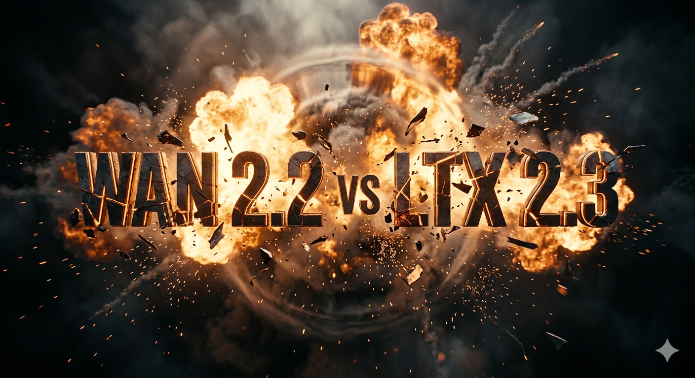
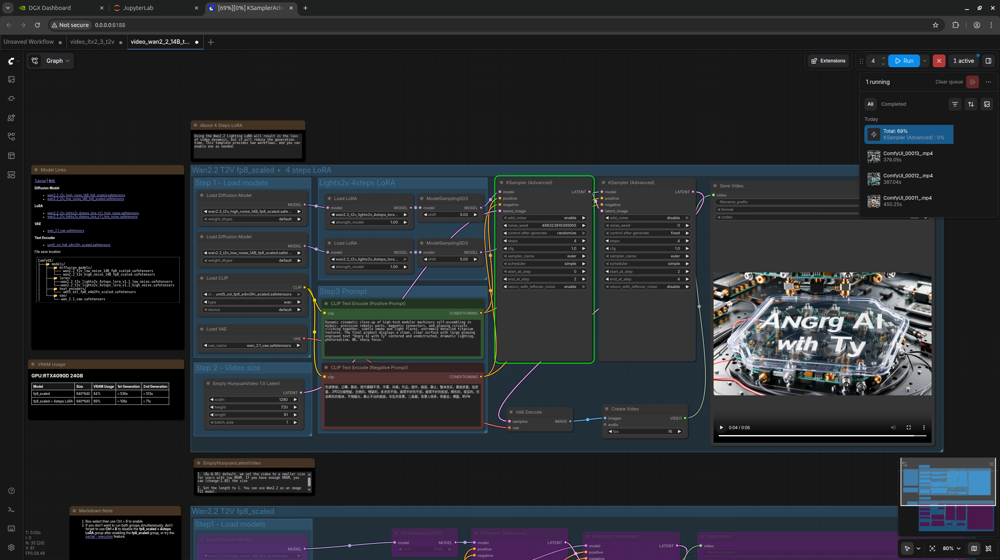
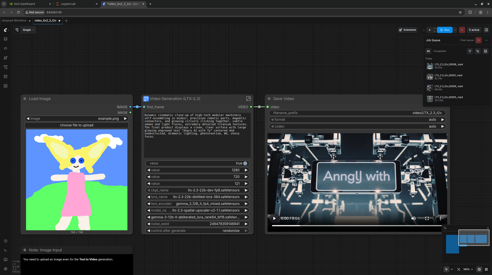
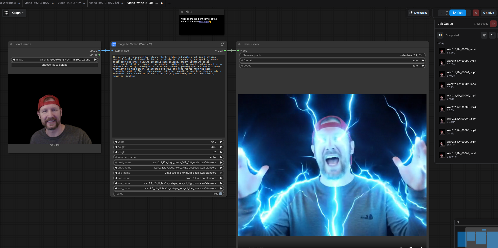
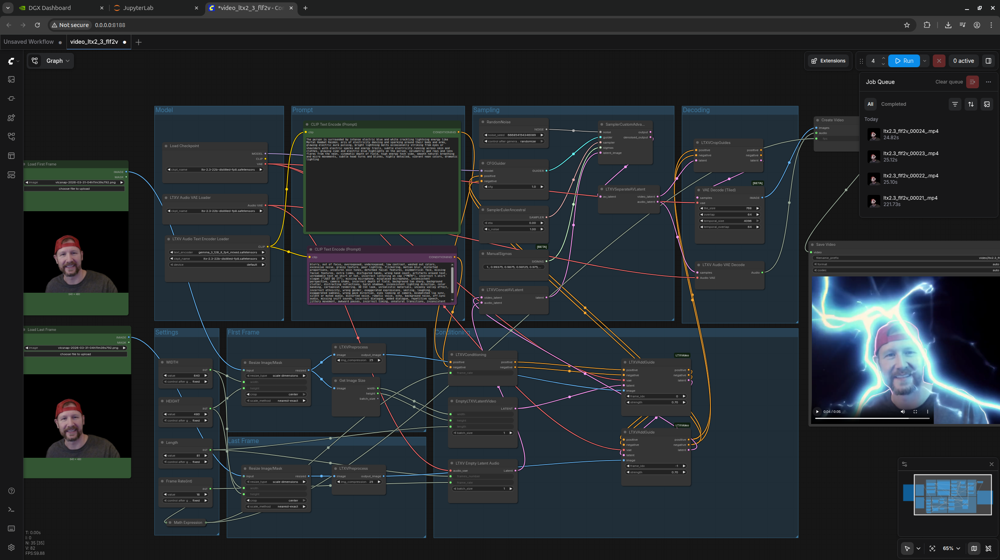

# Wan2.2 vs LTX2.3 Comparison

> All testing conducted using ComfyUI with default workflows.

## Test Parameters

| Parameter | Value |
| --- | --- |
| Resolution | 720p (Text-to-Video) / 640×480 (Image-to-Video) |
| Frames | 81 frames @ 16fps |
| Consistency | Same prompts across all tests |

---

## Text‑to‑Video Comparison

**Input:** 720p Resolution – Same Prompt – Default ComfyUI Workflows

| Category | Wan2.2 | LTX2.3 |
| --- | ---: | ---: |
| **Accuracy** | `17.5%` (3.5/20) | `5%` (1/20) |
| **Speed** | 6 min 8 sec | **90 seconds** ⚡ |
| **Memory Usage** | 87 GB | 92 GB |

> 💬 **My Take:** If text involvement is required, Wan2.2 wins decisively. LTX2.3 excels in speed and audio generation capabilities.

> **Discovery:** Using the FLF2V workflow produces much better results that have Text in them, Last frame containing the text
> 
---

## Image‑to‑Video Comparison

**Input:** 640×480 webcam source | **Output:** 640×480, 81 frames @ 16fps

| Category | Wan2.2 | LTX2.3 |
| --- | ---: | ---: |
| **Accuracy** | **Perfect (10/10)** ✅ | Poor (2/10) ❌ |
| **Speed** | 1 min 6 sec | **25 seconds** ⚡ |
| **Memory Usage** | 79 GB | 84 GB |

> 💬 **My Take:** Quality is clearly superior with Wan2.2. LTX2.3 wins on speed and audio generation, though it failed to visually produce desired results despite excellent generated audio output.

---

## Summary Results

| Category | Winner |
| --- | ---: |
| Text‑to‑Video | **Wan2.2** |
| Image‑to‑Video | **Wan2.2** |
| Speed | **LTX2.3** ⚡ |
| Audio Generation | **LTX2.3** 🎵 |
| Overall Winner | **Wan2.2** 🏅 |

---

## Personal Assessment

> _"For me as an average user who has never been to film school and doesn't really know how to compose scenes, Wan2.2 produced better results that were closer to what I wanted."_

### Additional Observations:

- ⚠️ **Methodology Note:** The comparison might be somewhat of an "apples to oranges" situation
- ✅ **Workflow Simplicity:** Default ComfyUI templates for Wan2.2 both just worked out of the box
- ❌ **LTX Struggles:** Image-to-video was a struggle with LTX, producing complete nonsense; only partial success achieved using flf2v variant
- 🔧 **Complexity Factor:** LTX seemed much more complex to configure for even remotely achieving desired outputs

### Final Verdict:

> _"If you can get LTX working properly, the speed and audio capabilities might be compelling. However, if it's fundamentally broken or too difficult to operate effectively, those features are worthless without reliable visual output."_